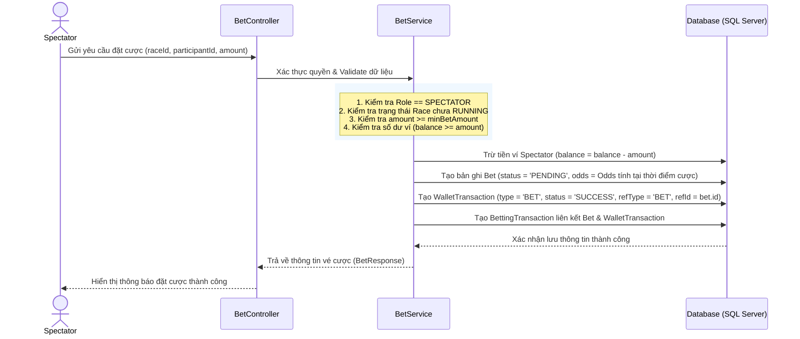
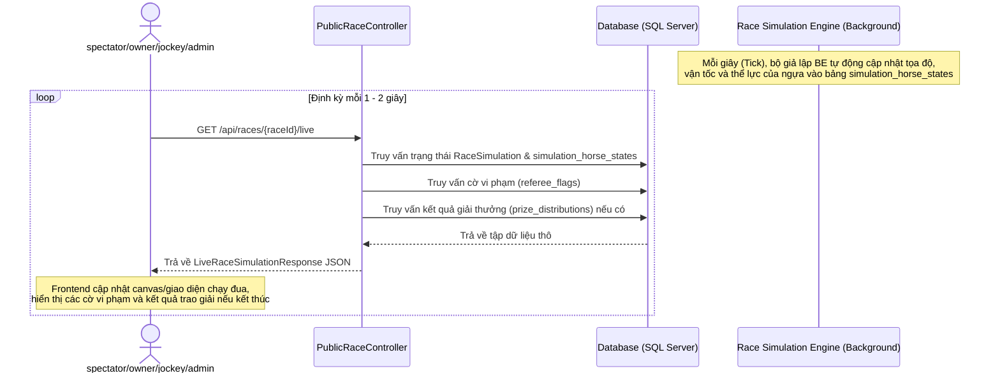

# BÁO CÁO THAY ĐỔI HỆ THỐNG CHI TIẾT
*Báo cáo tổng hợp toàn bộ các chỉnh sửa, cập nhật logic nghiệp vụ, đặc tả API và luồng hệ thống*

---

## I. TỔNG QUAN
Báo cáo này tóm tắt và ghi nhận toàn bộ các thay đổi lớn trong hệ thống kể từ khi đồng bộ từ GitHub. Các thay đổi bao gồm:
1. **Nâng cấp Nghiệp vụ**: Bổ sung luồng đặt cược cho Spectator (chia quỹ Pari-Mutuel) và luồng xem trực tiếp cuộc đua (Live simulation).
2. **Đặc tả & Thay đổi API**: Bổ sung các ràng buộc an toàn cho đặt cược, bắt đầu đua, và xác nhận kết quả.
3. **Cải tiến & Sửa lỗi Mã nguồn**: Sửa lỗi an toàn kiểu dữ liệu (Null type safety), loại bỏ các thư viện/chú thích không tối ưu, và cập nhật toàn bộ Unit Tests.

---

## II. DANH SÁCH CÁC TỆP TIN THAY ĐỔI TRONG HỆ THỐNG
Dưới đây là tổng hợp các tệp được thêm mới hoặc chỉnh sửa trực tiếp trong đợt cập nhật này:

### 1. Các tệp thêm mới (Added Files)
* [spectator_betting_test.postman_collection.json](file:///Users/minhvu2201/Documents/horse-racing-system/spectator_betting_test.postman_collection.json): Bộ sưu tập Postman mô phỏng kịch bản đặt cược và chạy đua thực tế của 2 Spectator và Referee.

### 2. Các tệp sửa đổi và nâng cấp logic (Modified Files)
* [BetService.java](file:///Users/minhvu2201/Documents/horse-racing-system/backend/src/main/java/com/horseracing/services/BetService.java): Phân quyền đặt cược, ràng buộc trạng thái `LOCKED_LIST` và kiểm tra simulation.
* [RefereeService.java](file:///Users/minhvu2201/Documents/horse-racing-system/backend/src/main/java/com/horseracing/services/RefereeService.java): Ràng buộc trạng thái bắt đầu đua, kiểm định ngựa trước trận, lọc dashboard trọng tài.
* [RaceRegistrationService.java](file:///Users/minhvu2201/Documents/horse-racing-system/backend/src/main/java/com/horseracing/services/RaceRegistrationService.java): Chuyển trạng thái sang `LOCKED_LIST` khi chốt danh sách, sửa lỗi Null safety khi trim chuỗi.
* [HorseService.java](file:///Users/minhvu2201/Documents/horse-racing-system/backend/src/main/java/com/horseracing/services/HorseService.java): Thay đổi switch-case tối ưu và sửa lỗi Null safety.
* [JockeyService.java](file:///Users/minhvu2201/Documents/horse-racing-system/backend/src/main/java/com/horseracing/services/JockeyService.java): Sửa lỗi Null safety và dọn dẹp các import thừa.
* [ErrorResponse.java](file:///Users/minhvu2201/Documents/horse-racing-system/backend/src/main/java/com/horseracing/dto/response/ErrorResponse.java): Loại bỏ Lombok Annotation để viết getters/setters tường minh.
* **Bộ mã nguồn kiểm thử (Unit Tests)**:
  * [BetServiceTest.java](file:///Users/minhvu2201/Documents/horse-racing-system/backend/src/test/java/com/horseracing/services/BetServiceTest.java)
  * [RefereeServiceTest.java](file:///Users/minhvu2201/Documents/horse-racing-system/backend/src/test/java/com/horseracing/services/RefereeServiceTest.java)
  * [TournamentServiceTest.java](file:///Users/minhvu2201/Documents/horse-racing-system/backend/src/test/java/com/horseracing/services/TournamentServiceTest.java)
  * [RaceServiceTest.java](file:///Users/minhvu2201/Documents/horse-racing-system/backend/src/test/java/com/horseracing/services/RaceServiceTest.java)

---

## III. ĐẶC TẢ CHI TIẾT LUỒNG ĐẶT CƯỢC SPECTATOR & XEM LIVE ĐUA

### 1. Quy tắc & Ràng buộc Đặt cược
* **Đối tượng tham gia**: Chỉ người dùng có vai trò `SPECTATOR` mới được phép đặt cược. Các vai trò khác như `HORSE_OWNER`, `JOCKEY`, `RACE_REFEREE` bị cấm đặt cược.
* **Thời gian mở cược**: Cổng đặt cược mở ngay khi danh sách thi đấu chính thức được công bố (Trạng thái cuộc đua là `OPEN_FOR_REGISTER` hoặc `CLOSED_FOR_REGISTER`).
* **Thời gian đóng cược**: Cổng cược tự động đóng hoàn toàn khi cuộc đua chính thức bắt đầu (Trạng thái chuyển sang `RUNNING`). Mọi yêu cầu đặt cược sau thời điểm này đều bị từ chối.
* **Mức cược tối thiểu (Min Bet)**: Số tiền đặt cược cho mỗi vé phải lớn hơn hoặc bằng mức cược tối thiểu (`minBetAmount`) được cấu hình trong Giải đấu (`Tournament`) tương ứng.
* **Ràng buộc số dư**: Số tiền đặt cược không được vượt quá số dư ví hiện tại của người dùng (`Wallet.balance`). Số dư ví của spectator sẽ bị trừ ngay lập tức khi đặt cược thành công.

### 1.1. Các Loại Đặt Cược Đề Xuất (Bet Types)
Hệ thống hỗ trợ 3 loại đặt cược phổ biến trong đua ngựa để tăng tính đa dạng:
1. **Win Bet (Cược Thắng / Vô Địch)**:
   - **Mô tả**: Người xem chọn chú ngựa sẽ cán đích ở vị trí **Hạng 1** (Winner).
   - **Tỷ lệ cược (Odds)**: Tính động theo công thức chia quỹ Pari-Mutuel.
2. **Place Bet (Cược Vị Trí / Top 2)**:
   - **Mô tả**: Người xem chọn chú ngựa sẽ cán đích ở vị trí **Hạng 1 hoặc Hạng 2**.
   - **Tỷ lệ cược (Odds)**: Thấp hơn cược Win (do xác suất trúng cao hơn).
3. **Show Bet (Cược Top 3)**:
   - **Mô tả**: Người xem chọn chú ngựa sẽ cán đích ở một trong các vị trí **Hạng 1, Hạng 2 hoặc Hạng 3**.
   - **Tỷ lệ cược (Odds)**: Thấp nhất trong 3 loại.

> [!NOTE]
> **Lưu ý thiết kế Cơ sở dữ liệu (DB)**: Đối với các loại cược kết hợp nhiều ngựa như `Quinella` và `Exacta` (nếu triển khai sau này), bảng `bets` hiện tại (chỉ có cột `participant_id` đơn lẻ) cần được điều chỉnh (ví dụ: bổ sung thêm cột `participant_id_2`, hoặc chuyển sang mô hình 1-N với bảng chi tiết `bet_selections` liên kết nhiều `participant_id` vào một vé cược).

---

### 2. Công thức Tính toán Tỷ lệ Cược theo Mô hình Chia Quỹ (Pari-Mutuel)
Trong mô hình này, tỷ lệ cược (Odds) không được chốt cứng cố định trước trận mà sẽ biến động liên tục theo số lượng người cược và chỉ được chốt chính thức sau khi cuộc đua kết thúc dựa trên tổng quỹ tiền cược gom được. Quy trình tính toán gồm các bước sau:

#### BƯỚC 1: Thu thập tổng quỹ cược (Pools) của từng loại cược
Tất cả tiền đặt cược được gom vào 3 quỹ riêng biệt tùy theo loại cược:
* `total_win_pool`: Tổng tiền cược cửa Win (Thắng).
* `total_place_pool`: Tổng tiền cược cửa Place (Top 2).
* `total_show_pool`: Tổng tiền cược cửa Show (Top 3).

Hệ thống giữ lại 10% làm phí nhà cái (House Edge = 10%), quỹ chia thưởng thực tế (Net Pool) còn lại 90% (hệ số hoàn thưởng là 0.9):
* `net_win_pool = total_win_pool * 0.9`
* `net_place_pool = total_place_pool * 0.9`
* `net_show_pool = total_show_pool * 0.9`

#### BƯỚC 2: Tính tỷ lệ cược (Odds) chính thức khi kết thúc cuộc đua
Các chú ngựa đạt thứ hạng thắng cược sẽ được chia quỹ thưởng tương ứng:

1. **Win Bet (Cược Thắng - Hạng 1)**:
   - Toàn bộ `net_win_pool` được chia cho những người cược vào chú ngựa về **Hạng 1**.
   - Công thức tính Odds của chú ngựa về Hạng 1:
     `Odds_Win = net_win_pool / Tổng_tiền_cược_Win_của_ngựa_Hạng_1`
     *(Giới hạn sàn tối thiểu là 1.05)*

2. **Place Bet (Cược Vị Trí - Hạng 1 hoặc 2)**:
   - Quỹ `net_place_pool` được chia đôi làm 2 phần bằng nhau cho những người cược ngựa về **Hạng 1** và **Hạng 2**.
   - Odds cho ngựa về Hạng 1:
     `Odds_Place_H1 = (net_place_pool / 2) / Tổng_tiền_cược_Place_của_ngựa_Hạng_1`
   - Odds cho ngựa về Hạng 2:
     `Odds_Place_H2 = (net_place_pool / 2) / Tổng_tiền_cược_Place_của_ngựa_Hạng_2`
     *(Giới hạn sàn tối thiểu là 1.05)*

3. **Show Bet (Cược Top 3 - Hạng 1, 2 hoặc 3)**:
   - Quỹ `net_show_pool` được chia ba làm 3 phần bằng nhau cho những người cược ngựa về **Hạng 1**, **Hạng 2** và **Hạng 3**.
   - Odds cho ngựa về Hạng i (i = 1, 2, 3):
     `Odds_Show_Hi = (net_show_pool / 3) / Tổng_tiền_cược_Show_của_ngựa_Hạng_i`
     *(Giới hạn sàn tối thiểu là 1.05)*

*(Giá trị odds được làm tròn 2 chữ số thập phân)*

#### VÍ DỤ SỐ MINH HỌA THỰC TẾ
Giả sử cuộc đua có 3 chú ngựa tham gia là **A, B, C**. Tổng tiền đặt cược thu được là **100 triệu VNĐ**:
* **Win Bet (Cược Thắng)**: Tổng cộng **40 triệu VNĐ**. Trong đó:
  - Đặt vào ngựa A: 25 triệu VNĐ.
  - Đặt vào ngựa B: 10 triệu VNĐ.
  - Đặt vào ngựa C: 5 triệu VNĐ.
* **Place Bet (Cược Top 2)**: Tổng cộng **60 triệu VNĐ**. Trong đó:
  - Đặt vào ngựa A: 35 triệu VNĐ.
  - Đặt vào ngựa B: 20 triệu VNĐ.
  - Đặt vào ngựa C: 5 triệu VNĐ.

Kết quả cuộc đua: **Ngựa B về Nhất (Hạng 1), Ngựa A về Nhì (Hạng 2), Ngựa C về Ba (Hạng 3)**.

* **Tính toán Odds và trả thưởng**:
  - **Win Bet (Cược Thắng)**: Ngựa B thắng.
    - Quỹ chia thưởng thực tế: `net_win_pool = 40 triệu * 0.9 = 36 triệu VNĐ`.
    - Odds của ngựa B: `Odds_Win_B = 36 triệu / 10 triệu = 3.60`
    - (Người cược ngựa B ăn tỷ lệ 3.60. Đặt 100k ăn 360k. Người cược ngựa A, C thua cược).
  - **Place Bet (Cược Top 2)**: Ngựa B (Hạng 1) và Ngựa A (Hạng 2) thắng.
    - Quỹ chia thưởng thực tế: `net_place_pool = 60 triệu * 0.9 = 54 triệu VNĐ`.
    - Chia đôi quỹ thưởng: Mỗi bên nhận `54 triệu / 2 = 27 triệu VNĐ`.
    - Odds của ngựa B (Hạng 1): `Odds_Place_B = 27 triệu / 20 triệu = 1.35` (Đặt 100k ăn 135k).
    - Odds của ngựa A (Hạng 2): `Odds_Place_A = 27 triệu / 35 triệu = 0.77` => Nhỏ hơn 1.05 nên lấy sàn `1.05` (Đặt 100k ăn 105k).
    - (Người cược ngựa C thua cược).

---

### 3. Quy trình Xử lý Nghiệp vụ & Giao dịch (Database & Wallet Flow)



---

### 4. Luồng Nghiệp vụ Phát sinh: Hoàn tiền & Trả thưởng

#### A. Trường hợp Hoàn tiền cược (Refund)
Hệ thống sẽ hoàn trả 100% số tiền đặt cược ban đầu vào ví của Spectator và gửi thông báo trong các trường hợp sau:
1. **Trận đấu bị Hủy bỏ (`CANCELLED`)**: Trọng tài hoặc hệ thống hủy trận đấu trước hoặc trong khi diễn ra.
2. **Ngựa không đạt kiểm tra trước trận (`REJECTED`)**: Trọng tài từ chối cho ngựa tham gia do không đạt cân nặng, sức khỏe, v.v.
3. **Cặp đua bị loại trước trận (`DISQUALIFIED` trước khi chạy)**: Bị loại do vi phạm quy chế trước khi cuộc đua bắt đầu.

*Hành động của hệ thống*:
* Cập nhật trạng thái vé cược `Bet.status = 'REFUNDED'`.
* Cộng tiền lại vào ví của Spectator: `Wallet.balance = Wallet.balance + Bet.amount`.
* Lưu giao dịch ví `WalletTransaction` (loại `REFUND`, trạng thái `SUCCESS`).

#### B. Trường hợp Kết thúc và Trả thưởng (Confirm Results & Payout)
Khi trọng tài xác nhận kết quả chính thức của trận đấu, hệ thống duyệt qua tất cả vé cược có trạng thái `PENDING` và cập nhật:

1. **Thu thập thông tin tiền cược & kết quả thực tế để tính toán Odds**:
   - Xác định tổng tiền cược của các quỹ: `total_win_pool`, `total_place_pool`, `total_show_pool` của cuộc đua đó.
   - Xác định tổng tiền đặt cược của các vé thắng (ví dụ: tổng tiền cược Win vào con ngựa Hạng 1, tổng tiền cược Place vào con ngựa Hạng 1, Hạng 2, v.v.).
   - Tính toán ra tỷ lệ Odds thực tế (`Odds_Win`, `Odds_Place` cho từng con ngựa về đích Top 2, `Odds_Show` cho từng con ngựa về đích Top 3) dựa trên các công thức Chia Quỹ ở Mục 2.

2. **Xác định kết quả thắng/thua theo loại đặt cược (`bet_type`)**:
   - **Với Win Bet (Cược Thắng)**: 
     - **Thắng (`WON`)**: Nếu ngựa đặt cược đạt `finalRank == 1`. 
     - **Thua (`LOST`)**: Nếu ngựa đạt `finalRank > 1`.
   - **Với Place Bet (Cược Vị Trí / Top 2)**: 
     - **Thắng (`WON`)**: Nếu ngựa đặt cược đạt `finalRank <= 2`.
     - **Thua (`LOST`)**: Nếu ngựa đạt `finalRank > 2`.
   - **Với Show Bet (Cược Top 3)**: 
     - **Thắng (`WON`)**: Nếu ngựa đặt cược đạt `finalRank <= 3`.
     - **Thua (`LOST`)**: Nếu ngựa đạt `finalRank > 3`.

3. **Quy tắc Trả thưởng & Cập nhật ví**:
   - **Nếu vé cược Thắng (`WON`)**:
     - Cập nhật tỷ lệ cược thực tế của vé cược đó: `Bet.odds` = Tỷ lệ Odds tính theo Chia Quỹ (chứ không dùng Odds dự kiến ban đầu).
     - Tính toán tiền thưởng: `payoutAmount = Bet.amount * Bet.odds`.
     - Cộng tiền thưởng vào ví Spectator: `Wallet.balance = Wallet.balance + payoutAmount`.
     - Lưu giao dịch ví `WalletTransaction` (loại `PRIZE`, trạng thái `SUCCESS`, refId = `bet.id`).
     - Gửi thông báo chúc mừng thắng cược cho Spectator.
   - **Nếu vé cược Thua (`LOST`)**:
     - Tiền thưởng nhận được `payoutAmount = 0`.
     - Không hoàn lại tiền cược gốc (do đã trừ từ lúc đặt cược).
     - Gửi thông báo kết quả đặt cược.

---

### 5. Luồng Xem Live Đua trên Trang của các Role (Public Live View Flow)
* **Quyền kiểm soát (Write Operations)**: Chỉ duy nhất Trọng tài (`RACE_REFEREE`) được phân công quản lý cuộc đua mới có quyền gọi các API thay đổi trạng thái cuộc đua:
  * Bắt đầu cuộc đua (`POST /api/referee/races/{id}/start`).
  * Gắn cờ vi phạm (`POST /api/referee/races/{id}/flags`).
  * Xác nhận kết quả (`POST /api/referee/races/{id}/confirm-results`).
  * Hủy cuộc đua (`POST /api/referee/races/{id}/cancel`).
  * *Tất cả các role khác (Spectator, Owner, Jockey, Admin) gọi vào các endpoint này sẽ nhận phản hồi `403 Forbidden`.*
* **Quyền xem (Read-only Operation)**: Mọi role đăng nhập vào hệ thống (hoặc thậm chí khách truy cập công cộng - Public) đều có quyền gọi API lấy dữ liệu mô phỏng trực tiếp để cập nhật giao diện thời gian thực.

#### Mô hình Hoạt động Xem Live đua (Polling Mechanism)



---

## IV. ĐẶC TẢ CHI TIẾT CÁC THAY ĐỔI CỦA API (API CHANGES)

### 1. API Đặt cược của Người xem (Spectator Place Bet)
* **Endpoint**: `POST /api/bets`
* **Quyền truy cập (Authorization)**: Chỉ dành cho người dùng đăng nhập có vai trò `SPECTATOR`.
* **Request Body**:
  ```json
  {
    "raceId": 12,
    "participantId": 34,
    "amount": 50000.0
  }
  ```
* **Các ràng buộc mới bổ sung (New Validations)**:
  1. **Ràng buộc vai trò (Role-based Restriction)**: Hệ thống kiểm tra vai trò của User. Nếu người dùng **không phải** là `SPECTATOR` (ví dụ: `ADMIN`, `HORSE_OWNER`, `JOCKEY`, `RACE_REFEREE`), hệ thống trả về lỗi `403 Forbidden` với thông điệp: `"Chỉ người xem (SPECTATOR) mới được phép đặt cược."`
  2. **Ràng buộc trạng thái cuộc đua (Race Status Restriction)**: Chỉ cho phép đặt cược khi cuộc đua ở trạng thái **`LOCKED_LIST`** (danh sách đã chốt và công bố chính thức). Nếu cuộc đua ở bất kỳ trạng thái nào khác, hệ thống trả về lỗi `400 Bad Request` với thông điệp: `"Cổng đặt cược đã đóng. Đặt cược chỉ khả dụng khi danh sách đã được chốt và công bố."`
  3. **Ràng buộc tiến trình giả lập (Simulation Progress Restriction)**: Chặn đặt cược nếu quá trình giả lập/mô phỏng cuộc đua đã chạy xong (Bản ghi `RaceSimulation` có trạng thái là `FINISHED`), kể cả khi trạng thái cuộc đua chưa cập nhật xong. Nếu vi phạm, hệ thống trả về lỗi `400 Bad Request` với thông điệp: `"Cuộc đua đã chạy xong, cổng đặt cược đã đóng."`

---

### 2. API Bắt đầu cuộc đua của Trọng tài (Referee Start Race)
* **Endpoint**: `POST /api/referee/races/{id}/start`
* **Quyền truy cập (Authorization)**: Chỉ Trọng tài (`RACE_REFEREE`) được phân công quản lý cuộc đua.
* **Các ràng buộc mới bổ sung (New Validations)**:
  1. **Ràng buộc trạng thái cuộc đua bắt đầu (Race Status Restriction)**: Trạng thái cuộc đua bắt buộc phải là **`LOCKED_LIST`**. Nếu không, hệ thống trả về lỗi: `"Race must be LOCKED_LIST to start"`
  2. **Ràng buộc kiểm định ngựa tham gia (Pre-race Inspection Validation)**: Hệ thống kiểm tra toàn bộ các ngựa tham gia đăng ký trong cuộc đua. Nếu còn bất kỳ ngựa nào chưa hoàn tất kiểm định (vẫn ở trạng thái **`PENDING_INSPECTION`**), hệ thống sẽ chặn và trả về lỗi: `"Cannot start race. All participants must be inspected first."`
  3. **Ràng buộc số lượng ngựa hợp lệ tối thiểu (Approved Participants Validation)**: Phải có ít nhất **1 ngựa** đã được duyệt kiểm định thành công (trạng thái là **`APPROVED`**). Nếu không có ngựa nào được duyệt (ví dụ: tất cả đều bị từ chối/loại), hệ thống sẽ chặn và trả về lỗi: `"Cannot start race. No approved participants in this race."`
  4. **Logic cập nhật trạng thái ngựa khi bắt đầu (Participant Status Transition)**: Chỉ các chú ngựa có trạng thái kiểm định là **`APPROVED`** mới được cập nhật sang trạng thái **`RACING`** để tham gia chạy giả lập. Các chú ngựa bị loại trước trận (`DISQUALIFIED`) hoặc bị từ chối (`REJECTED`) sẽ giữ nguyên trạng thái và không được tham gia cuộc đua.

---

### 3. API Xác nhận kết quả cuộc đua của Trọng tài (Referee Confirm Results)
* **Endpoint**: `POST /api/referee/races/{id}/confirm-results`
* **Quyền truy cập (Authorization)**: Chỉ Trọng tài (`RACE_REFEREE`) được phân công quản lý cuộc đua.
* **Ràng buộc mới bổ sung (New Validation)**:
  1. **Kiểm tra tiến trình giả lập (Simulation Completion Check)**: Chỉ cho phép xác nhận kết quả nếu quá trình giả lập cuộc đua (Race Simulation) đã hoàn tất và kết thúc hoàn toàn (trạng thái của `RaceSimulation` là **`FINISHED`**). Nếu cuộc đua đang chạy giả lập chưa xong hoặc chưa được kích hoạt chạy, hệ thống sẽ chặn và trả về lỗi: `"Cannot confirm results. The race simulation has not finished yet."`

---

### 4. API Chốt danh sách đăng ký cuộc đua (Confirm Registration)
* **Endpoint**: `POST /api/referee/races/{id}/confirm-registration`
* **Thay đổi hành vi**: Khi chốt danh sách và đóng cổng đăng ký thành công, trạng thái cuộc đua sẽ chuyển thành **`LOCKED_LIST`** (thay vì `CLOSED_FOR_REGISTER` như trước).

---

### 5. API Lấy danh sách cuộc đua của Trọng tài (Referee Get Races)
* **Endpoint**: `GET /api/referee/races`
* **Tham số lọc**: `status=upcoming` hoặc `status=preparation`
* **Thay đổi hành vi**: Trả về thêm các cuộc đua có trạng thái là `OPEN_FOR_REGISTER` và `LOCKED_LIST` (thay vì chỉ `Upcoming` và `CLOSED_FOR_REGISTER` như trước). Điều này giúp Trọng tài có thể nhìn thấy các cuộc đua ở trạng thái mới để tiến hành kiểm định chất lượng ngựa chuẩn bị cho cuộc đua.

---

### 6. API Dashboard của Trọng tài (Referee Dashboard Summary)
* **Endpoint**: `GET /api/referee/dashboard`
* **Thay đổi hành vi**: Chỉ số cuộc đua sắp tới (`upcomingRaces`) và số lượng ngựa cần kiểm định (`horsesToInspect`) đã được mở rộng để quét qua cả các cuộc đua có trạng thái là `LOCKED_LIST` và `OPEN_FOR_REGISTER` (bên cạnh các trạng thái cũ).

---

### 7. API Lịch thi đấu sắp tới của Jockey (Jockey Get Schedule)
* **Endpoint**: `GET /api/jockeys/schedule`
* **Thay đổi hành vi**: Bổ sung bộ lọc điều kiện trên luồng trả về: Loại bỏ hoàn toàn các cuộc đua đã kết thúc (`FINISHED`) hoặc bị hủy bỏ (`CANCELLED`). Jockey sẽ chỉ thấy lịch thi đấu thực sự chuẩn bị diễn ra.

---

### 8. API Lịch sử thi đấu của Jockey (Jockey Get History)
* **Endpoint**: `GET /api/jockeys/history`
* **Thay đổi hành vi**: Sửa đổi điều kiện truy vấn dữ liệu từ cơ sở dữ liệu: Thay vì lọc theo trạng thái của người tham gia (Participant Status = `FINISHED` - vốn không chính xác vì đây là trạng thái của ngựa chạy), hệ thống đã chuyển sang lọc chuẩn xác theo trạng thái của chính cuộc đua (Race Status = `FINISHED`).

---

## V. CHI TIẾT CÁC TỆP SỬA ĐỔI & NÂNG CẤP MÃ NGUỒN

| Tệp tin (File) | Loại thay đổi | Chi tiết nội dung đã sửa đổi |
| :--- | :--- | :--- |
| [BetService.java](file:///Users/minhvu2201/Documents/horse-racing-system/backend/src/main/java/com/horseracing/services/BetService.java) | Logic nghiệp vụ | • Giới hạn chỉ có vai trò `SPECTATOR` mới được phép đặt cược.<br>• Thay đổi trạng thái cuộc đua hợp lệ để đặt cược thành `LOCKED_LIST`.<br>• Chặn đặt cược nếu quá trình mô phỏng cuộc đua đã kết thúc. |
| [RefereeService.java](file:///Users/minhvu2201/Documents/horse-racing-system/backend/src/main/java/com/horseracing/services/RefereeService.java) | Logic nghiệp vụ | • Ràng buộc trạng thái bắt đầu cuộc đua phải là `LOCKED_LIST`.<br>• Kiểm tra toàn bộ ngựa đã hoàn thành kiểm định (không còn trạng thái `PENDING_INSPECTION`).<br>• Ràng buộc phải có tối thiểu 1 ngựa được phê duyệt (`APPROVED`) mới cho phép bắt đầu.<br>• Chỉ cập nhật trạng thái các ngựa `APPROVED` sang `RACING` (loại bỏ ngựa `DISQUALIFIED` khỏi đường đua).<br>• Chặn xác nhận kết quả nếu mô phỏng đua chưa kết thúc.<br>• Hỗ trợ lọc trạng thái `LOCKED_LIST` trên dashboard trọng tài. |
| [RaceRegistrationService.java](file:///Users/minhvu2201/Documents/horse-racing-system/backend/src/main/java/com/horseracing/services/RaceRegistrationService.java) | Logic & Sửa cảnh báo | • Chuyển trạng thái cuộc đua sang `LOCKED_LIST` khi chốt đăng ký.<br>• Thay thế tham chiếu phương thức `String::trim` bằng lambda `s -> s.trim()` để tránh cảnh báo Null type safety. |
| [HorseService.java](file:///Users/minhvu2201/Documents/horse-racing-system/backend/src/main/java/com/horseracing/services/HorseService.java) | Sửa cảnh báo | • Thay thế `UpgradeRequest::getDocumentUrls` bằng lambda `req -> req.getDocumentUrls()` để sửa cảnh báo Null type safety.<br>• Thay thế chuỗi câu lệnh `if-else` bằng `switch` statement trong `toHorseResponse`. |
| [JockeyService.java](file:///Users/minhvu2201/Documents/horse-racing-system/backend/src/main/java/com/horseracing/services/JockeyService.java) | Sửa cảnh báo | • Thay thế `UpgradeRequest::getDocumentUrls` bằng lambda để sửa cảnh báo Null type safety.<br>• Loại bỏ import không sử dụng `UpgradeRequest`. |
| [ErrorResponse.java](file:///Users/minhvu2201/Documents/horse-racing-system/backend/src/main/java/com/horseracing/dto/response/ErrorResponse.java) | Tối ưu mã nguồn | • Loại bỏ các chú thích Lombok (`@Data`, `@NoArgsConstructor`, `@AllArgsConstructor`) và thay thế bằng mã nguồn tường minh (getters/setters, constructors) để cải thiện độ tương thích. |
| **Các file kiểm thử (`*Test.java`)** | Unit Tests | • Cập nhật [BetServiceTest.java](file:///Users/minhvu2201/Documents/horse-racing-system/backend/src/test/java/com/horseracing/services/BetServiceTest.java), [RefereeServiceTest.java](file:///Users/minhvu2201/Documents/horse-racing-system/backend/src/test/java/com/horseracing/services/RefereeServiceTest.java), [TournamentServiceTest.java](file:///Users/minhvu2201/Documents/horse-racing-system/backend/src/test/java/com/horseracing/services/TournamentServiceTest.java), [RaceServiceTest.java](file:///Users/minhvu2201/Documents/horse-racing-system/backend/src/test/java/com/horseracing/services/RaceServiceTest.java) để tương thích với logic `LOCKED_LIST` và các ràng buộc kiểm tra mới. |

---

## VI. KỊCH BẢN KIỂM THỬ VÀ BỘ SƯU TẬP POSTMAN
Để tạo điều kiện thuận lợi cho việc kiểm thử tự động, một bộ sưu tập Postman đã được cung cấp tại [spectator_betting_test.postman_collection.json](file:///Users/minhvu2201/Documents/horse-racing-system/spectator_betting_test.postman_collection.json).

### Kịch bản kiểm thử quy trình Đặt cược & Trả thưởng (2 Spectators & 1 Referee)
1. **Thiết lập & Đăng nhập (Auth & Setup)**:
   - Đăng nhập tài khoản Spectator 1 (`spectator1@test.com`) để lấy token.
   - Đăng nhập tài khoản Spectator 2 (`spectator2@test.com`) để lấy token.
   - Đăng nhập tài khoản Trọng tài (`referee@gmail.com`) để lấy token.
2. **Kiểm tra ví & Đặt cược**:
   - Truy vấn số dư ví của Spectator 1 và Spectator 2 trước khi đặt cược.
   - **Spectator 1** đặt cược vào chú ngựa có khả năng Thắng (Ví dụ: `participantId = 1`) với số tiền `50,000` loại `WIN`.
   - **Spectator 2** đặt cược vào chú ngựa khác (Ví dụ: `participantId = 2`) với số tiền `150,000` loại `WIN`.
   - Xác nhận số dư ví của cả hai spectator đã bị trừ tương ứng ngay lập tức.
3. **Tiến trình Cuộc đua (Referee Operations)**:
   - Trọng tài bắt đầu cuộc đua (Race 1) bằng cách gửi yêu cầu `POST /api/referee/races/1/start`. Trạng thái chuyển sang `RUNNING`.
   - Trọng tài xác nhận kết quả cuộc đua sau khi quá trình giả lập kết thúc bằng cách gọi `POST /api/referee/races/1/confirm-results`.
4. **Kiểm tra trả thưởng & số dư sau cược**:
   - Hệ thống tính toán Odds chia quỹ thực tế (Pari-Mutuel) cho các Spectator thắng cược.
   - Kiểm tra lại ví của Spectator thắng cược xem đã được cộng tiền thưởng chính xác theo tỷ lệ cược động chưa.
   - Kiểm tra lại ví của Spectator thua cuộc (không đổi, tiền đã trừ từ trước).

---

## VII. KẾT LUẬN
Mã nguồn hiện tại đã được dọn sạch toàn bộ các cảnh báo Null type safety của IDE, logic nghiệp vụ về luồng đặt cược và tổ chức đua của trọng tài đã hoạt động đồng bộ với quy trình chốt danh sách (`LOCKED_LIST`) và kiểm định kỹ lưỡng. Dự án biên dịch thành công 100% không gặp lỗi.
