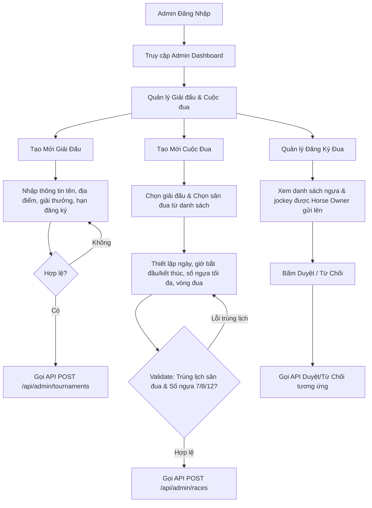

# Kế Hoạch Triển Khai Giao Diện Quản Lý Giải Đấu & Cuộc Đua (Admin)

Tài liệu này được biên soạn nhằm hướng dẫn và bàn giao chi tiết công việc cho nhóm Frontend (FE) để hiện thực hóa **Luồng tạo giải đấu, cuộc đua và duyệt đăng ký** dành cho vai trò **ADMIN**.

---

## 📌 1. Tổng Quan Luồng Nghiệp Vụ (Workflow)



Luồng gồm 4 chức năng cốt lõi trên giao diện Admin:
1. **Xem danh sách và chi tiết giải đấu** (hiển thị trạng thái giải đấu: `Upcoming`, `Ongoing`, `Completed`).
2. **Tạo giải đấu mới** (nhập tên giải đấu, địa điểm, thời gian, giải thưởng Top 1, 2, 3 và mức cược tối thiểu).
3. **Tạo cuộc đua (Race) thuộc giải đấu** (chọn giải đấu, chọn sân đua, thiết lập thời gian, kiểm tra trùng lịch sân).
4. **Quản lý danh sách đăng ký thi đấu** (duyệt/từ chối ngựa và nài ngựa do Horse Owner gửi lên).

---

## 🎨 2. Hướng Dẫn Thiết Kế Giao Diện (UI/UX) & Layout

Giao diện sẽ được tích hợp vào file [AdminPage.jsx](file:///c:/Users/MSI VN/Documents/Raphael/SWP391-SU26/project/horse-racing-system/frontend/src/pages/Admin/AdminPage.jsx) và sử dụng hệ thống style có sẵn trong file [Dashboard.css](file:///c:/Users/MSI VN/Documents/Raphael/SWP391-SU26/project/horse-racing-system/frontend/src/pages/Dashboard.css) để giữ tính nhất quán về thẩm mỹ (Glassmorphism, Tone xanh lục đậm của trường đua).

### 📐 Tổ chức Tabs trên AdminPage:
Để tránh trang bị quá tải thông tin, hãy chia cột bên phải (`<main>`) thành các tab chức năng sử dụng state đơn giản:
- **Tab 1: Upgrade Requests** (Đã có sẵn trong code hiện tại).
- **Tab 2: Tournament & Race Creator** (Quản lý và tạo mới Giải đấu/Cuộc đua).
- **Tab 3: Race Registrations** (Duyệt đăng ký thi đấu của các Horse Owners).

### 🛠️ Áp dụng CSS Classes có sẵn:
- **Card chứa:** Dùng class `.glass-card` để tạo hiệu ứng kính mờ đặc trưng.
- **Tiêu đề card:** Dùng `.card-title` kết hợp với thẻ `<svg>` làm icon trực quan.
- **Form đầu vào:** Dùng các class `.form-row`, `.form-group`, `.form-input` để các trường nhập liệu tự động căn lề, có viền mờ và hiệu ứng phát sáng màu vàng cam (`#fcd34d`) khi focus.
- **Trạng thái badge:** Dùng `.status-badge` với các modifier `status-loading`, `status-success`, `status-error` để hiển thị trạng thái API phản hồi.

---

## 🔗 3. Chi Tiết API Tích Hợp (API Contract)

Toàn bộ các yêu cầu HTTP dưới đây bắt buộc phải gửi kèm **Access Token** trong Header (`Authorization: Bearer <token>`). Các bạn chỉ cần import và sử dụng [axiosClient.js](file:///c:/Users/MSI VN/Documents/Raphael/SWP391-SU26/project/horse-racing-system/frontend/src/api/axiosClient.js) vì client này đã được cấu hình tự động đính kèm token và cơ chế tự động refresh token khi hết hạn.

### 3.1. API Lấy Danh Sách Sân Đua (Tracks)
Dùng để hiển thị dropdown cho Admin chọn sân khi tạo cuộc đua.
- **Endpoint:** `GET /api/admin/tracks`
- **Response trả về (JSON Array):**
```json
[
  {
    "id": 1,
    "name": "Trường Đua Đại Nam",
    "location": "Bình Dương",
    "surfaceCondition": "Cỏ Tự Nhiên (Khô)"
  },
  {
    "id": 2,
    "name": "Trường Đua Phú Thọ",
    "location": "TP. Hồ Chí Minh",
    "surfaceCondition": "Cát Mịn"
  }
]
```

### 3.2. API Tạo Mới Giải Đấu (Tournament)
- **Endpoint:** `POST /api/admin/tournaments`
- **Request Body (JSON):**
```json
{
  "tournamentName": "Giải Đua Ngựa Truyền Thống Vô Địch Quốc Gia 2026",
  "location": "Bình Dương",
  "description": "Giải đấu thường niên quy tụ các nài ngựa xuất sắc nhất toàn quốc.",
  "registrationDeadline": "2026-06-10T17:00:00", // Định dạng LocalDateTime (YYYY-MM-DDTHH:mm:ss)
  "maxSlots": 50,
  "startDate": "2026-06-15", // Định dạng LocalDate (YYYY-MM-DD)
  "endDate": "2026-06-20", // Định dạng LocalDate (YYYY-MM-DD)
  "prizeFirst": 50000000.00, // Kiểu số thực (Decimal)
  "prizeSecond": 25000000.00,
  "prizeThird": 10000000.00,
  "minBetAmount": 50000.00
}
```
> ⚠️ **Lưu ý định dạng dữ liệu:**
> - Đầu vào của `registrationDeadline` trên giao diện dùng `<input type="datetime-local"/>` sẽ trả ra chuỗi dạng `YYYY-MM-DDTHH:mm`. Hãy nhớ ghép thêm giây `:00` trước khi gửi lên API để tránh lỗi phân tích cú pháp của Jackson ở Backend.
> - `startDate` và `endDate` dùng `<input type="date"/>` sẽ trả ra chuỗi dạng `YYYY-MM-DD` đúng chuẩn.

- **Response trả về thành công (Status 201 Created):**
```json
{
  "id": 5,
  "tournamentName": "Giải Đua Ngựa Truyền Thống Vô Địch Quốc Gia 2026",
  "location": "Bình Dương",
  "description": "Giải đấu thường niên quy tụ các nài ngựa xuất sắc nhất toàn quốc.",
  "registrationDeadline": "2026-06-10T17:00:00",
  "maxSlots": 50,
  "startDate": "2026-06-15",
  "endDate": "2026-06-20",
  "totalPrize": 85000000.00, // Tự động tính = First + Second + Third
  "tournamentStatus": "Upcoming",
  "prizeFirst": 50000000.00,
  "prizeSecond": 25000000.00,
  "prizeThird": 10000000.00,
  "minBetAmount": 50000.00,
  "createdAt": "2026-05-31T21:00:00",
  "updatedAt": "2026-05-31T21:00:00"
}
```

### 3.3. API Tạo Mới Cuộc Đua (Race)
Mỗi giải đấu sẽ chứa một hoặc nhiều cuộc đua (Race Rounds).
- **Endpoint:** `POST /api/admin/races`
- **Request Body (JSON):**
```json
{
  "raceName": "Vòng Loại Bảng A - Cự Ly 1200m",
  "tournamentId": 5, // ID của giải đấu vừa tạo ở trên
  "raceTrackId": 1, // ID của sân đua được chọn từ dropdown
  "raceDate": "2026-06-15", // Định dạng LocalDate (YYYY-MM-DD)
  "startTime": "08:30:00", // Định dạng LocalTime (HH:mm:ss)
  "endTime": "09:00:00", // Định dạng LocalTime (HH:mm:ss)
  "raceRound": 1, // Vòng đua thứ mấy (số nguyên dương)
  "maxHorses": 8, // Số ngựa tối đa được tham gia (chỉ chấp nhận: 7, 8, hoặc 12)
  "distance": 1200.0, // Cự ly đua (mét hoặc km - số thực dương)
  "surfaceType": "Cỏ",
  "weather": "Nắng nhẹ"
}
```
> ⚠️ **Lưu ý định dạng dữ liệu:**
> - `startTime` và `endTime` từ `<input type="time"/>` của HTML sẽ trả về dạng `HH:mm`. Nhớ format bằng cách thêm `:00` ở cuối trước khi gửi để thành `HH:mm:ss` đúng chuẩn.

- **Response trả về thành công (Status 201 Created):**
```json
{
  "id": 12,
  "raceName": "Vòng Loại Bảng A - Cự Ly 1200m",
  "tournamentId": 5,
  "tournamentName": "Giải Đua Ngựa Truyền Thống Vô Địch Quốc Gia 2026",
  "raceTrackId": 1,
  "raceTrackName": "Trường Đua Đại Nam",
  "raceDate": "2026-06-15",
  "startTime": "08:30:00",
  "endTime": "09:00:00",
  "raceRound": 1,
  "maxHorses": 8,
  "distance": 1200.0,
  "surfaceType": "Cỏ",
  "weather": "Nắng nhẹ",
  "status": "OPEN_FOR_REGISTER" // Trạng thái mặc định tự động kích hoạt
}
```

### 3.4. Các API Duyệt Đăng Ký Đua (Race Registrations)
Khi các Horse Owners đăng ký ngựa & Jockey tham gia, Admin cần duyệt để đưa vào danh sách tham gia chính thức.
- **Lấy toàn bộ đăng ký:** `GET /api/admin/race-registrations`
  - *Response JSON Array* gồm các trường thông tin: `id`, `raceName`, `horseName`, `jockeyName`, `ownerName`, `ownerSharePercent`, `jockeySharePercent`, `status` (thường là `PENDING`, `APPROVED`, `REJECTED`).
- **Duyệt đăng ký:** `PUT /api/admin/race-registrations/{id}/approve`
- **Từ chối đăng ký:** `PUT /api/admin/race-registrations/{id}/reject`

---

## 🛡️ 4. Quy Tắc Validation (Ràng Buộc Phía Client)

Để tối ưu hóa trải nghiệm người dùng (UX) và tránh các lỗi không cần thiết gửi lên server, FE cần cài đặt các quy tắc validation tại chỗ trước khi cho phép gửi form:

### 🏆 Khi Tạo Giải Đấu:
1. **Tên giải đấu (`tournamentName`):** Bắt buộc, không được rỗng.
2. **Tiền thưởng (`prizeFirst`, `prizeSecond`, `prizeThird`):**
   - Phải là số và $\ge 0$.
   - Nên validate logic: `prizeFirst` > `prizeSecond` > `prizeThird`.
3. **Mức cược tối thiểu (`minBetAmount`):** Phải là số và $\ge 0$.
4. **Thời gian đăng ký (`registrationDeadline`):**
   - Hạn đăng ký phải diễn ra **trước** ngày bắt đầu giải đấu (`startDate`).
5. **Ngày diễn ra giải đấu (`startDate` & `endDate`):**
   - `startDate` phải $\le$ `endDate`.
   - `startDate` phải là ngày ở tương lai (so với ngày hiện tại).

### 🐎 Khi Tạo Cuộc Đua (Race):
1. **Giờ đua (`startTime` & `endTime`):**
   - `startTime` phải diễn ra **trước** `endTime`.
2. **Số ngựa thi đấu tối đa (`maxHorses`):**
   - Bắt buộc phải chọn một trong 3 cấu hình: **7**, **8**, hoặc **12** con ngựa (sử dụng dropdown `<select>` thay vì ô nhập số tự do để tránh lỗi nhập sai giá trị).
3. **Khoảng cách (`distance`):** Phải là số dương (> 0).

---

## 💻 5. Mã Nguồn Tham Khảo Cho FE (React Hooks & Axios)

Dưới đây là đoạn code gợi ý cách thức gọi các API bằng `axiosClient` trên UI mới.

### 5.1. Hook lấy dữ liệu ban đầu (Tracks & Tournaments):
```javascript
import { useState, useEffect } from 'react';
import axiosClient from '../../api/axiosClient';

// Lấy danh sách sân đua
export const useRaceTracks = () => {
  const [tracks, setTracks] = useState([]);
  const [loading, setLoading] = useState(false);

  useEffect(() => {
    setLoading(true);
    axiosClient.get('/admin/tracks')
      .then(res => setTracks(res.data))
      .catch(err => console.error("Lỗi lấy sân đua:", err))
      .finally(() => setLoading(false));
  }, []);

  return { tracks, loading };
};
```

### 5.2. Hàm xử lý gửi form tạo Giải đấu:
```javascript
const handleCreateTournament = async (formData) => {
  try {
    // 1. Format registrationDeadline sang định dạng YYYY-MM-DDTHH:mm:ss
    const formattedDeadline = formData.registrationDeadline.includes(':') && formData.registrationDeadline.split(':').length === 2 
      ? `${formData.registrationDeadline}:00` 
      : formData.registrationDeadline;

    const payload = {
      ...formData,
      registrationDeadline: formattedDeadline,
      prizeFirst: parseFloat(formData.prizeFirst),
      prizeSecond: parseFloat(formData.prizeSecond),
      prizeThird: parseFloat(formData.prizeThird),
      minBetAmount: parseFloat(formData.minBetAmount),
      maxSlots: formData.maxSlots ? parseInt(formData.maxSlots) : null
    };

    const response = await axiosClient.post('/admin/tournaments', payload);
    alert("Tạo giải đấu thành công! ID: " + response.data.id);
    
    // Refresh danh sách giải đấu hoặc chuyển tab
  } catch (error) {
    const errorMsg = error.response?.data?.message || "Không thể tạo giải đấu";
    alert("Lỗi: " + errorMsg);
  }
};
```

### 5.3. Hàm xử lý gửi form tạo Cuộc đua (Race):
```javascript
const handleCreateRace = async (formData) => {
  try {
    // Format startTime & endTime sang dạng HH:mm:ss
    const formatTime = (timeStr) => {
      if (!timeStr) return "";
      return timeStr.split(':').length === 2 ? `${timeStr}:00` : timeStr;
    };

    const payload = {
      ...formData,
      tournamentId: parseInt(formData.tournamentId),
      raceTrackId: parseInt(formData.raceTrackId),
      startTime: formatTime(formData.startTime),
      endTime: formatTime(formData.endTime),
      raceRound: parseInt(formData.raceRound),
      maxHorses: parseInt(formData.maxHorses),
      distance: parseFloat(formData.distance)
    };

    const response = await axiosClient.post('/admin/races', payload);
    alert("Tạo cuộc đua thành công! Trạng thái: " + response.data.status);
  } catch (error) {
    // Xử lý lỗi trùng lịch sân đua (Overlap check từ Backend trả về lỗi 400)
    const errorMsg = error.response?.data?.message || "Không thể tạo cuộc đua";
    alert("Lỗi: " + errorMsg);
  }
};
```

---

## 📋 6. Kế Hoạch Kiểm Thử Thủ Công (Manual Verification Plan)

Sau khi tích hợp xong, các bạn cần phối hợp kiểm thử với các chức năng sau:
1. **Kiểm thử Trùng Lịch Sân:**
   - Tạo `Race A` trên `Sân 1` vào ngày `2026-06-15` từ `08:00` đến `09:00`.
   - Cố tình tạo tiếp `Race B` cũng trên `Sân 1` cùng ngày `2026-06-15` nhưng từ `08:30` đến `09:30`.
   - **Mong đợi:** Giao diện hiển thị lỗi cảnh báo trùng lịch màu đỏ một cách rõ ràng (đọc từ phản hồi lỗi 400 của Backend).
2. **Kiểm thử số ngựa tối đa:**
   - Thử nhập dữ liệu tự do ngoài danh sách 7, 8, 12 nếu sửa HTML.
   - **Mong đợi:** Dropdown bị khóa cứng trong 3 giá trị 7, 8, 12 để đảm bảo tính an toàn dữ liệu.
3. **Kiểm thử Hạn đăng ký:**
   - Tạo giải đấu có `startDate` là `2026-06-10` nhưng set `registrationDeadline` là `2026-06-12`.
   - **Mong đợi:** Form hiển thị lỗi ngay lập tức dưới dạng tooltip hoặc chữ đỏ thông báo hạn đăng ký phải trước ngày bắt đầu.
