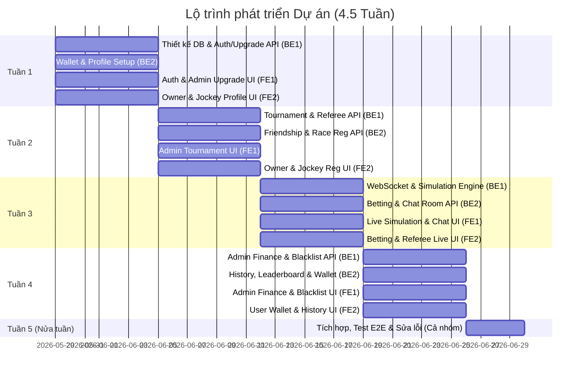

# KẾ HOẠCH & TIMELINE PHÂN CHIA CÔNG VIỆC DỰ ÁN HỆ THỐNG QUẢN LÝ ĐUA NGỰA

* **Thời gian thực hiện:** 4.5 Tuần (khoảng 31-32 ngày)
* **Cơ cấu nhóm:** 4 thành viên (2 Backend Developers - **BE1, BE2**; 2 Frontend Developers - **FE1, FE2**)
* **Mục tiêu:** Hoàn thiện luồng từ Đăng ký, Duyệt quyền, Tạo giải đấu, Kết bạn/Đăng ký tham gia đua, Giả lập đua thời gian thực (WebSocket), Cá cược, Quản lý ví, Chatroom và Quản trị hệ thống.

---

## BẢNG PHÂN CHIA CÔNG VIỆC CHI TIẾT THEO TUẦN

---

### TUẦN 1: NỀN TẢNG (CORE DB), XÁC THỰC (AUTH) & YÊU CẦU NÂNG CẤP VAI TRÒ
* **Mục tiêu:** Thiết kế toàn bộ cơ sở dữ liệu, tích hợp xong luồng Auth trên FE và hoàn thành luồng gửi yêu cầu nâng cấp Role (Spectator -> Horse Owner / Jockey) và Admin duyệt.

#### 💻 BACKEND
* **BE1 (Core & Auth/User Management):**
  * Thiết kế chi tiết Database Schema cho toàn bộ hệ thống (User, Horse, Jockey, Tournament, Race, Bet, Wallet, Transaction, Friendship, UpgradeRequest, Blacklist).
  * Viết các Migration/Entity bằng JPA/Hibernate.
  * Tích hợp Swagger OpenAPI để FE có tài liệu kết nối.
  * Xây dựng API: Gửi yêu cầu nâng cấp Role (cho Spectator chọn Role muốn nâng lên và điền thông tin/profile đính kèm).
  * Xây dựng API: Admin duyệt/từ chối yêu cầu nâng cấp Role (kèm lý do nếu từ chối).
* **BE2 (Wallet & Profile Setup):**
  * Xây dựng cơ chế Ví tiền (Wallet) & API giao dịch cơ bản (Mock Nạp/Rút tiền ảo cho người dùng).
  * Xây dựng API CRUD thông tin chi tiết của Horse (Chủ ngựa thêm, sửa, xóa ngựa của mình).
  * Xây dựng API CRUD thông tin chi tiết của Jockey (Quản lý hồ sơ cá nhân của nài ngựa: cân nặng, lịch sử, kinh nghiệm).

#### 🎨 FRONTEND
* **FE1 (Auth & Admin Upgrade UI):**
  * Tích hợp các API Xác thực đã có (`/login`, `/register` mặc định SPECTATOR, `/google`, `/refresh`, `/me`) vào Client. Lưu Token vào localStorage và cài đặt Axios Interceptors tự động refresh token.
  * Làm trang cá nhân của Spectator: Có nút "Yêu cầu nâng cấp tài khoản" -> hiện form chọn Role mong muốn (Horse Owner hoặc Jockey) và điền hồ sơ đính kèm.
  * Làm trang Admin duyệt tài khoản: Danh sách các yêu cầu nâng cấp đang chờ (Pending), nút Duyệt (Approve) và nút Từ chối (Reject) kèm ô nhập lý do.
* **FE2 (Horse Owner & Jockey Profile UI):**
  * Thiết kế Layout & UI Dashboard riêng biệt cho từng Role (khi đăng nhập, dựa vào Role để điều hướng về Dashboard tương ứng).
  * Làm UI quản lý cho Horse Owner: Trang quản lý danh sách ngựa của mình (thêm mới ngựa, xem chi tiết ngựa, sửa thông tin).
  * Làm UI quản lý cho Jockey: Trang xem thông tin cá nhân của Jockey, cập nhật cân nặng, kinh nghiệm.

---

### TUẦN 2: HỆ THỐNG MỐI QUAN HỆ & ĐĂNG KÝ GIẢI ĐẤU
* **Mục tiêu:** Tạo mối liên kết giữa Chủ ngựa & Jockey (bắt buộc kết bạn/chấp nhận lời mời) và cho phép Đăng ký tham gia các giải đấu do Admin tạo.

#### 💻 BACKEND
* **BE1 (Tournament & Referee API):**
  * Xây dựng API CRUD Giải đấu (Tournament) và Cuộc đua (Race) dành cho Admin (Tạo giải đấu, set giải thưởng, thời gian bắt đầu, số lượng ngựa tối đa, luật chơi).
  * Xây dựng API cho Trọng tài (Race Referee): Cập nhật trạng thái sân đua (hợp lệ hay không), kiểm tra cân nặng của Jockey trước giờ đua (nếu Jockey quá cân nặng quy định sẽ bị từ chối tham gia).
* **BE2 (Social / Friendship & Race Registration API):**
  * Xây dựng API kết bạn/liên kết giữa Horse Owner và Jockey (Gửi lời mời kết bạn, đồng ý/từ chối kết bạn).
  * Xây dựng API đăng ký tham gia cuộc đua: Horse Owner chọn ngựa của mình + chọn Jockey đã kết bạn để đăng ký vào một Race.
  * Xây dựng API xác nhận tham gia trước giờ đua (Horse Owner và Jockey phải xác nhận sẵn sàng trước thời điểm cuộc đua bắt đầu 15-30 phút).

#### 🎨 FRONTEND
* **FE1 (Admin Tournament & Referee UI):**
  * Làm UI Admin: Tạo và quản lý danh sách giải đấu, thêm các cuộc đua vào giải đấu, cấu hình giải thưởng.
  * Làm UI Trọng tài: Danh sách các cuộc đua cần chuẩn bị. Trọng tài có thể nhập trạng thái sân và kiểm tra/tick xác nhận cân nặng của Jockey đăng ký.
* **FE2 (Horse Owner & Jockey Social UI):**
  * Làm UI kết bạn: Horse Owner có thể tìm kiếm Jockey, Jockey có thể tìm kiếm Horse Owner và gửi lời mời kết nối. Danh sách bạn bè hiện tại.
  * Làm UI Đăng ký đua cho Horse Owner: Xem danh sách các giải đấu đang mở đăng ký -> Chọn ngựa -> Chọn Jockey trong danh sách bạn bè -> Gửi đăng ký đua.
  * Làm UI cho Jockey nhận lời mời tham gia đua từ Horse Owner (Jockey xác nhận đồng ý cưỡi ngựa nào ở giải nào).

---

### TUẦN 3: GIẢ LẬP ĐUA NGỰA THỜI GIAN THỰC (WEBSOCKET) & CHAT ROOM
* **Mục tiêu:** Xây dựng tính năng quan trọng nhất của hệ thống: Giả lập cuộc đua chạy bằng WebSocket và Chat room trong phòng đua cho người xem.

#### 💻 BACKEND
* **BE1 (WebSocket Setup & Simulation Engine):**
  * Cấu hình WebSocket (Spring WebSocket với STOMP & SockJS).
  * Xây dựng công cụ giả lập cuộc đua (Simulation Engine): Khi cuộc đua bắt đầu, backend sẽ chạy một luồng background tính toán vị trí di chuyển của các con ngựa dựa trên chỉ số (tốc độ, thể lực của ngựa và Jockey) và phát sóng (broadcast) tọa độ hiện tại của các ngựa mỗi 500ms qua WebSocket.
  * Xây dựng API/WebSocket cho Trọng tài điều khiển trạng thái cuộc đua (Bắt đầu, Tạm dừng, Tiếp tục, Kết thúc).
  * Xây dựng API cho Trọng tài gắn cờ vi phạm (Flag violation) đối với ngựa vi phạm trong lúc đua.
* **BE2 (Chat Room & Live Stats API):**
  * Xây dựng WebSocket Chat Room: Người xem truy cập phòng đua có thể gửi tin nhắn và nhận tin nhắn thời gian thực.
  * Xây dựng API lấy thông tin chi tiết thời gian thực của cuộc đua (danh sách ngựa tham gia, tỷ lệ cược hiện tại, trạng thái cuộc đua).

#### 🎨 FRONTEND
* **FE1 (Live Simulation & Chat Room UI):**
  * Làm trang phòng đua trực tiếp (Live Race Page): Kết nối WebSocket để nhận tọa độ ngựa.
  * Vẽ sân đua giả lập trực quan (Sử dụng CSS Animation, SVG hoặc HTML5 Canvas) để biểu diễn các con ngựa chạy đua dựa trên tọa độ nhận được thời gian thực.
  * Làm khung Chat room bên cạnh màn hình đua để Spectators có thể trò chuyện trực tiếp khi xem đua.
* **FE2 (Referee Live Control & Betting Integration Setup):**
  * Làm UI Trọng tài trực tiếp điều hành trận đua: Có các nút bấm Bắt đầu/Tạm dừng/Dừng cuộc đua để gửi tín hiệu điều khiển lên BE.
  * Làm các nút cho phép Trọng tài bấm phạt vi phạm (Flag violation) của từng con ngựa trực tiếp trên màn hình giám sát.
  * Chuẩn bị phần khung hiển thị tỷ lệ cược của các ngựa trên giao diện Live Race chuẩn bị cho tuần sau.

---

### TUẦN 4: HỆ THỐNG CÁ CƯỢC, QUẢN LÝ VÍ & PHÂN TÍCH DOANH THU
* **Mục tiêu:** Tích hợp tính năng đặt cược, tự động trả thưởng sau cuộc đua, thống kê doanh thu cho Admin, và xử lý tài khoản vi phạm (Blacklist).

#### 💻 BACKEND
* **BE1 (Admin Finance, Commission & Blacklist):**
  * Xây dựng logic cá cược: Cho phép đặt cược trước khi cuộc đua bắt đầu, khóa đặt cược khi cuộc đua bắt đầu.
  * Xây dựng API thống kê doanh thu cho Admin: Tổng tiền cược, tổng tiền thắng/thua của spectator, tỷ lệ cắt phế (rake/commission) của hệ thống.
  * Xây dựng API quản lý Blacklist: Trọng tài/Admin đưa tài khoản vi phạm vào danh sách đen, chặn không cho đăng nhập hoặc tham gia đua.
* **BE2 (Betting Payouts, Wallet Ledger & Leaderboards):**
  * Xây dựng logic tự động thanh toán (Payout Engine): Khi cuộc đua kết thúc (kết quả được lưu), tự động cộng tiền thưởng cho người thắng cược (Spectator) và cộng tiền thưởng giải đấu cho Horse Owner/Jockey thắng cuộc.
  * Lưu vết lịch sử giao dịch ví (Transaction Ledger) rõ ràng để đối soát.
  * Xây dựng API Bảng xếp hạng (Leaderboards) hiển thị các Jockey xuất sắc nhất, Ngựa thắng nhiều nhất, Người chơi thắng cược nhiều nhất.

#### 🎨 FRONTEND
* **FE1 (Admin Finance & Blacklist UI):**
  * Làm Dashboard thống kê doanh thu cho Admin (Biểu đồ doanh thu tiền phế cá cược, tổng lượng tiền nạp/rút).
  * Làm UI quản lý danh sách đen (Blacklist): Hiển thị danh sách các tài khoản vi phạm, lý do phạt, nút mở khóa (unban).
* **FE2 (User Wallet, Betting Page & Leaderboards UI):**
  * Làm giao diện ví chi tiết cho User: Hiển thị số dư hiện tại, lịch sử nạp/rút tiền, lịch sử đặt cược (trận đấu nào, cược con nào, số tiền, thắng/thua bao nhiêu).
  * Tích hợp panel Đặt cược vào màn hình phòng đua trước giờ bắt đầu (Spectator chọn ngựa muốn cược, nhập số tiền cược).
  * Làm trang Bảng xếp hạng (Leaderboard) & Lịch sử giải đấu để người dùng theo dõi.

---

### TUẦN 5 (0.5 TUẦN CUỐI): TÍCH HỢP TOÀN DIỆN, KIỂM THỬ (TEST E2E) & HOÀN THIỆN DEMO
* **Mục tiêu:** Cả nhóm cùng nhau kết nối, chạy thử toàn bộ luồng từ đầu đến cuối, tối ưu hóa giao diện và fix bug.

* **CÔNG VIỆC CHUNG (Cả 4 thành viên):**
  * **Test E2E Luồng Chính:**
    1. Đăng ký tài khoản -> Spectator gửi yêu cầu nâng cấp -> Admin duyệt lên Horse Owner / Jockey.
    2. Admin tạo Tournament & cuộc đua.
    3. Horse Owner thêm ngựa -> Kết bạn với Jockey -> Đăng ký đua -> Xác nhận tham gia.
    4. Trọng tài kiểm tra sân, cân nặng Jockey -> Kích hoạt cuộc đua chuẩn bị.
    5. Spectator vào phòng đua đặt cược -> Chat chít nói chuyện.
    6. Trọng tài nhấn Bắt đầu cuộc đua -> Hệ thống giả lập chạy thời gian thực qua WebSocket -> Kết thúc cuộc đua.
    7. Hệ thống tự động trả tiền cược cho Spectator, trả giải thưởng cho Owner/Jockey -> Cập nhật lịch sử ví.
  * **Tối ưu hóa & Sửa lỗi:** Tối ưu hóa hiệu năng render WebSocket (tránh giật lag màn hình đua ngựa), xử lý các case mạng yếu, mất kết nối WebSocket.
  * **Deploy Demo:** Cấu hình Docker Compose để deploy chạy thử cả Frontend và Backend cùng Database SQL Server.

---

## 💡 NGUYÊN TẮC PHỐI HỢP ĐỂ ĐẢM BẢO TIẾN ĐỘ

1. **Khớp nối API trước khi code (API Contract):**
   * Ngay đầu mỗi tuần, BE và FE phụ trách module đó phải thảo luận trước về **Request Body** và **Response JSON** (Sử dụng Swagger hoặc viết vào tài liệu chung). Tránh trường hợp BE viết một kiểu, FE vẽ màn hình một kiểu dẫn đến lỗi khi tích hợp.
2. **Làm việc độc lập bằng Mock Data:**
   * Trong lúc BE chưa hoàn thành API, FE nên dùng dữ liệu giả lập (mock data) để dựng giao diện trước. Khi BE xong API chỉ cần thay thế URL gọi là chạy được ngay, không bị chờ đợi nhau.
3. **Daily Meeting ngắn:**
   * Mỗi ngày nên dành ra 5-10 phút để cập nhật: *Hôm qua làm được gì? Hôm nay sẽ làm gì? Có khó khăn (blocker) gì cần người khác hỗ trợ không?* Điều này cực kỳ quan trọng cho một dự án làm việc nhóm trong thời gian ngắn.
